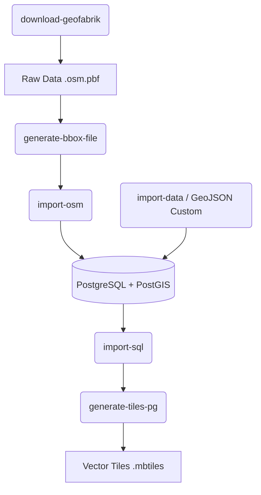
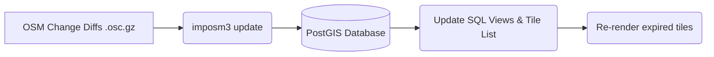

# Hướng dẫn triển khai hệ thống tự động hóa dữ liệu Vector Tiles (GTEL Maps)

Tài liệu này cung cấp hướng dẫn chuyên sâu cho đội ngũ DevOps để triển khai hệ thống biên dịch và phân phối bản đồ Vector Tiles (dựa trên OpenMapTiles và PostgreSQL/PostGIS) lên môi trường Production.

> [!IMPORTANT]
> Toàn bộ quy trình này yêu cầu môi trường thực thi có hiệu năng phần cứng cao, đặc biệt là tốc độ I/O của thiết bị lưu trữ (SSD/NVMe) và dung lượng RAM để đảm bảo tính ổn định trong quá trình xử lý không gian (spatial processing).

---

## 1. Tổng quan (The What & Why)

### 1.1 What: Tổng quan về OpenMapTiles

**OpenMapTiles** là một metadata schema và framework mã nguồn mở được thiết kế để chuẩn hóa và biên dịch dữ liệu địa lý, đặc biệt là OpenStreetMap (OSM) thành chuẩn Vector Tiles. Khác với quy trình render bản đồ ảnh (Raster Tiles) nặng nề truyền thống, framework này đóng gói hình học vector và metadata vào cấu trúc phân tầng thông minh dạng `.mbtiles`, giúp map-client vẽ lại bản đồ trực tiếp trên thiết bị (trình duyệt, mobile app) tiết kiệm hàng chục lần băng thông và storage.

### 1.2 Why: Tại sao sử dụng OpenMapTiles cho GTEL Maps?

Việc áp dụng kiến trúc chuẩn OpenMapTiles mang lại các giá trị cốt lõi trên Production:

- **Self-hosted hoàn toàn**: Toàn bộ quá trình từ dữ liệu thô, cho đến rendering đều khép kín, không phụ thuộc Google Maps hay Mapbox API.
- **Real-time Custom Styling**: Dữ liệu vector giữ nguyên các thuộc tính. Chỉ với 1 file MBTiles cấp phát, phía Web/App có thể render theo ý muốn mà Server không phải tốn CPU.
- **Inject dữ liệu nội bộ**: Cấu trúc layer rõ ràng giúp kỹ sư GIS dễ dàng đưa thêm các layer Custom của doanh nghiệp hòa lẫn vào nền tảng map công cộng một cách mượt mà.

---

## 2. Kiến trúc dự án (Project Architecture)

Dự án được tổ chức dựa trên kiến trúc của OpenMapTiles, phục vụ việc biên dịch và ánh xạ dữ liệu không gian thành Vector Tiles.

### 2.1 Tổng quan thư mục và runtime

Dưới đây là bức tranh toàn cảnh về các thành phần cấu thành dự án tại cấp thư mục gốc:

- **`data/`**: Nơi lưu trữ dữ liệu. Chứa file đầu vào `.osm.pbf` và các tệp changelog `.osc.gz`. Đây cũng là đích đến thông thường của file Vector Tiles (`.mbtiles`) sau khi quá trình build hoàn tất.
- **`build/`**: Thư mục lưu trữ các file trung gian được tạo ra tự động (auto-generated) trong quá trình biên dịch (như các file SQL tổng hợp, imposm3 mapping schemas).
- **`cache/`**: Nơi lưu giữ các bộ đệm tạm thời nhằm tăng tốc các lần xử lý không gian (spatial queries) tiếp theo.
- **`style/`**: Chuyên dùng lưu các tệp JSON cấu hình hiển thị (Mapbox GL Style/MapLibre), cho phép render style trên phía Client/Viewer (nếu có tích hợp kèm frontend).
- **`tests/`**: Bộ kịch bản kiểm thử (integration test, db query test).
- **`.env`** & **`docker-compose.yml`**: Control plane của dự án để khởi chạy DB, cấp RAM/CPU, và mount volume cho biến môi trường (Database credentials, Max connections).
- **`Makefile`** & **`quickstart.sh`**: Tập hợp các lệnh tự động hóa phục vụ rút ngắn các thao tác thủ công (từ download dữ liệu đến việc gọi tool sinh map). Được ưu tiên dùng cho Testing/Staging Pipeline.

### 2.2 Các thành phần cốt lõi cần tập trung (Core Components)

Đối với đội ngũ vận hành và kỹ sư dữ liệu, việc tùy chỉnh Vector Tiles sẽ xoay quanh các thành phần lõi sau:

- **`layers/`**: Định nghĩa logic xử lý không gian cho tường tiểu mục bản đồ (POI, water, transportation, boundaries...).
  - Bên trong từng thư mục của layer chứa file `.yaml` mô tả metadata.
  - Đi kèm với đó là các file `.sql` chứa logic tạo Materialized Views để gom nhóm, lọc (filter) hoặc đơn giản hóa (simplify) tọa độ từ bảng gốc PostGIS.
- **`mapping/` & `sql/`** _(Nếu có custom)_: File định nghĩa logic map dữ liệu cho `imposm3`. Nhờ thẻ này, engine sẽ biết cách phân rã các tags JSON thô của OpenStreetMap vào các quan hệ bảng cột trên PostgreSQL giúp đọc cực nhanh.

> [!TIP]
> **Trái tim của hệ thống: `openmaptiles.yaml`**
> Nằm ngay thư mục gốc, đóng vai trò bản quy hoạch tổng thể. Nó chịu trách nhiệm nhóm toàn bộ các layer nhỏ lẻ lại, thiết lập zoom limits (minzoom/maxzoom), khai báo languages đa ngôn ngữ, và thông tin bản quyền. Mọi can thiệp thêm/bớt layer đều phải bắt đầu từ việc cập nhật đường dẫn tại tệp cấu hình trung tâm này.

---

## 3. Quy trình xử lý và cập nhật dữ liệu (The How)

### 3.1. Khởi tạo Service và Build Schema (Service Initialization)

Trước khi bắt đầu bất cứ tiến trình import hay sinh tile nào, hệ thống cần được làm sạch, khởi tạo các thư mục trống và build ra các file mapping/SQL phù hợp với tùy chỉnh hiện tại.

Cấu hình `.env` để các container tool kết nối tới PostgreSQL Production:

```env
PGDATABASE=openmaptiles
PGUSER=openmaptiles
PGPASSWORD=<password>
PGHOST=<postgres-host-or-ip>
PGPORT=<postgres-port>
```

Build schema local:

```bash
# Xóa các file build cũ để tránh xung đột
make clean

# Sinh các file cấu hình tại thư mục build/ (mapping.yaml, sql/run_last.sql,...) dựa vào openmaptiles.yaml
make
```

Vì Production dùng database external, không chạy `make start-db`. Các target Make có dependency `start-db`/`start-db-nowait` cần chạy với GNU Make option `-o` để bỏ qua recipe start service `postgres` trong compose:

```bash
make <target>
```

Kiểm tra kết nối từ container tool:

```bash
docker compose run --rm openmaptiles-tools sh -lc 'pgwait && psql.sh -c "SELECT version(); SHOW jit;"'
```

### 3.2. Quy trình khởi tạo dữ liệu (Full Generation - Cold Start)

Quy trình này áp dụng cho việc deploy lần đầu tiên hoặc khi cần rebuild lại toàn bộ dữ liệu `.mbtiles` từ một file `.osm.pbf` thô hoàn toàn mới. Luồng xử lý như sau:



#### Quy trình thực thi:

1. **`download-geofabrik`**: Tải file nén `.osm.pbf` từ server Geofabrik nếu người dùng chưa cung cấp.
2. **`generate-bbox-file`**: Phân tích file pbf và xuất ra Bounding Box file (`.bbox`) nhằm khoanh vùng tọa độ sinh tile (tránh mất công gen ra vùng viền mây rác rỗng).
3. **`import-osm` (Sử dụng Imposm3)**: Đọc file `.osm.pbf` gốc, parse và đẩy vào các bảng Postgres theo rules trong `mapping/`.
4. **`import-data` (Rất quan trọng)**: Ngoài dữ liệu OSM thuần, bước này có tác dụng chèn các cấu trúc bản đồ ở mức zoom thấp (Low Zoom Level) bao gồm _Natural Earth_, _Water Polygons_, và _Lake Labels_. Nếu thiếu bước này, bản đồ zoom out (đứng từ trên cao nhìn xuống) sẽ bị lỗi hiển thị đại dương/lục địa. Ở giai đoạn này, bạn cũng sẽ gọi các lệnh `ogr2ogr` để nạp dữ liệu ranh giới nội bộ của Việt Nam (GeoJSON layers).
5. **`import-sql`**: Chạy tập lệnh SQL trong `layers/` để tạo các Materialized Views và kết hợp data sẵn sàng cho module sinh vectortiles.
6. **`generate-tiles-pg`**: Quét toàn bộ schema, truy vấn data bằng lệnh PostGIS native (ST_AsMVT) và đóng gói vào SQLite `.mbtiles`.

**Ví dụ quy trình các lệnh:**

```bash
make download-geofabrik area=vietnam
make generate-bbox-file area=vietnam
make import-data
# (Tùy chọn: Nhập các layer ranh giới hành chính... thông qua custom data handler)
make import-custom-data format=geojson

make import-osm area=vietnam
make import-wikidata
make import-sql
make generate-tiles-pg
```

> [!WARNING]
> **Tài nguyên phần cứng PostgreSQL**
>
> - **RAM**: Trong quá trình `import-osm` và `generate-tiles-pg`, PostgreSQL (qua `shared_buffers`, `maintenance_work_mem`) cần lượng RAM lớn (tối thiểu 32GB - 64GB cho một quốc gia như Việt Nam) để load indexes và buffers lên memory.
> - **Storage I/O**: Quá trình sinh tile sẽ lock và tạo rất nhiều read-reads, do đó NVMe/SSD là bắt buộc. Nếu sử dụng HDD hoặc mạng storage chậm (như rẽ nhánh NAS qua 1Gbps) sẽ khiến quá trình gen mất tới hàng tuần.

---

### 3.3. Quy trình cập nhật dữ liệu (Incremental Updates - Daily)

Thay vì chạy Full Generation cực kỳ tốn thời gian, ở môi trường Production, hệ thống áp dụng cơ chế cập nhật gia tăng (Incremental Updates). Điều này giúp dữ liệu bản đồ luôn mới mà không cần nạp lại toàn bộ database.



#### Quy trình thực thi:

1. **Update với imposm3**: Kéo file thay đổi `.osc.gz` hàng ngày từ OSM. `imposm3 diff` sẽ cập nhật trực tiếp vào PostGIS.
2. **Quản lý Expired Tiles**: `imposm3` xuất danh sách các tile chịu ảnh hưởng.
3. **Cập nhật SQL**: Refresh Materialized View.
4. **Re-render**: Tạo đè file MBTiles cho các tọa độ tile ảnh hưởng.

> [!IMPORTANT]
> **Điều kiện tiên quyết cho cập nhật gia tăng:**
> Trước khi thực hiện lệnh `make download` và `import-osm` lần đầu bản build, bạn **bắt buộc** phải thiết lập `DIFF_MODE=true` trong file `.env`. Nếu không, database sẽ thiếu các cấu trúc cần thiết để xử lý sự thay đổi (replication metadata).

Hiện tại hệ thống hỗ trợ 2 cơ chế cập nhật:

1. **Cập nhật thủ công (Manual One-time Import)**

Sử dụng khi bạn đã chuẩn bị sẵn file thay đổi `.osc.gz` trong thư mục `data/`.

```bash
# Nạp file changes.osc.gz vào database
make import-diff

# Sau khi nạp xong, tiến hành render lại các tile bị ảnh hưởng
make generate-changed-tiles
```

2. **Cập nhật tự động (Automatic Continuous Updates)**

Sử dụng tiến trình chạy ngầm để liên tục theo dõi và nạp dữ liệu từ các server OSM (như Geofabrik hoặc OSM.fr).

```bash
# Khởi chạy service cập nhật chạy ngầm (Container: update-osm)
make start-update-osm

# Theo dõi logs tiến trình cập nhật
docker compose logs --tail 100 --follow update-osm

# Dừng tiến trình cập nhật khi cần
make stop-update-osm
```

> [!CAUTION]
> Khi tiến trình `update-osm` đang thực thi việc nạp dữ liệu vào DB, **không thể** thực hiện lệnh `generate-tiles-pg` song song vì sẽ xảy ra lỗi xung đột (deadlocks) truy cập database.

3. **Render lại các tile bị thay đổi (Re-render Expired Tiles)**

Sau mỗi lần cập nhật (dù thủ công hay tự động), danh sách các tile bị ảnh hưởng sẽ được ghi lại trong thư mục `diffdir`. Bạn cần chạy lệnh sau để cập nhật file `.mbtiles` hiện có:

```bash
# Cập nhật file mbtiles bằng cách render đè các tile đã hết hạn (expired)
make generate-changed-tiles
```

### 3.4. Đặc thù dữ liệu GTEL Maps: Đa mức Zoom (Multi-Zoom Levels) và Chiến lược Merge

Hệ thống GTEL Maps hoạt động dựa trên chiến thuật chia để trị nhằm khống chế dung lượng tile:

- **`world.mbtiles`**: Render từ mức zoom **0** đến **7** cho toàn thế giới (tổng hợp cái nhìn vị trí vĩ mô).
- **`vietnam.mbtiles`**: Render từ mức zoom **8** đến **15** chuyên biệt cho khu vực Việt Nam (độ chi tiết giao thông sâu nhất).

> [!WARNING]
> Mỗi khi chuyển đổi tiến trình (ví dụ chuyển từ chạy World 0-7 sang chạy Vietnam 8-15), **bắt buộc** phải thực hiện:
>
> - Thay đổi cặp cấu hình `MIN_ZOOM`, `MAX_ZOOM` trong file `.env`; và `minzoom`, `maxzoom` trong `openmaptiles.yaml`.
> - Thay đổi tên file output `MBTILES_FILE` trong `.env`.
>
> **Lưu ý quan trọng:** Cứ mỗi lần thay đổi, bạn phải thực thi lệnh `make clean` và `make` lại một lần nữa để service được sinh file cấu hình mapping/sql mới chuẩn với giới hạn zoom.

**Giải pháp Merge MBTiles cho Production:**
Hai mbtiles trên sau khi được gen/cập nhật qua đêm xong không thể gắn trực tiếp song song vào TileServer một cách lỏng lẻo. Bắt buộc phải được trộn thành 1 file duy nhất bằng các module như `tile-join` (Của Mapbox Tippecanoe).

```bash
# Hợp nhất 2 file lại thành 1 file cấp phát
tile-join -o gtelmaps_streets_v1.mbtiles world.mbtiles vietnam.mbtiles
```

_Ghi chú Metadata:_
Module `tile-join` khi trộn có thể làm các trường thuộc tính metadata bên trong CSDL SQLite (.mbtiles) bị suy biến sai định dạng thông tin min/maxzoom. Do đó, sau bước `tile-join`, bạn cần sử dụng tool SQL (`sqlite3`) hoặc bash script update đè lại nguyên xi bảng `metadata` của file `gtelmaps_streets_v1.mbtiles` bằng nội dung trích xuất từ template `metadata.csv` được đặt sẵn ở thư mục `data/`.

```bash
# Cập nhật metadata
sqlite3 gtelmaps_streets_v1.mbtiles <<EOF
DELETE FROM metadata;
.mode csv
.import data/metadata.csv metadata
EOF
```

---

## 4. Tối ưu hóa Production & CI/CD

Để tự động hóa dòng chảy công việc này và đảm bảo an toàn, cần kết hợp các quy trình thiết lập chuẩn:

### 4.1. Automation (Tự động hóa)

- **Cronjob/Airflow DAG**: Lập lịch kéo `.osc` lúc 1:00 AM mỗi ngày. Chạy bash script gom nhóm các bước: `Download -> imposm3 update -> refresh SQL -> render diff`.
- **Docker/Kubernetes Jobs**: Tiến trình đóng gói dưới dạng Job có thời hạn. Xử lý xong sẽ tự động terminate, giải phóng memory để phục vụ các dịch vụ API khác.

### 4.2. Giám sát & Healthcheck

- **Log & Alert**: Gửi webhook (Slack/Telegram) nếu Job bị fail (lỗi Out of Memory - OOM Kill, hoặc lỗi imposm3 parsing).
- **Time SLA**: Theo dõi duration của cronjob. Nếu thời gian gen diff đột ngột tăng lên nhiều giờ, có thể database đang vỡ index cấu trúc (cần `VACUUM ANALYZE`).
- **Disk Usage Alert**: Giám sát phân vùng Postgres `/var/lib/postgresql/data`. Phình to WAL files trong lúc import có thể gây crash full-disk.
